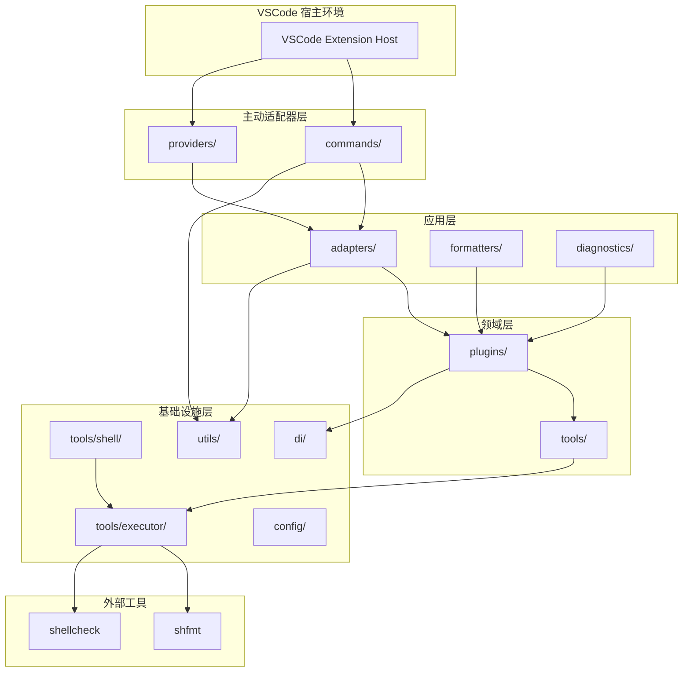
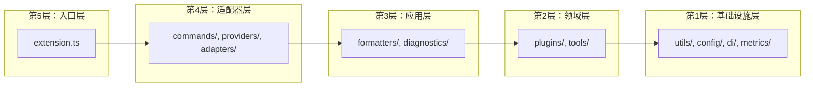
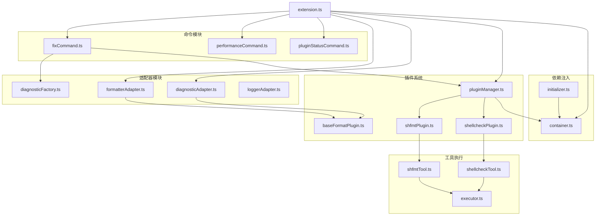

# Shell Formatter 架构分析报告

**项目名称**: Shell Formatter VSCode Extension
**分析日期**: 2026-01-30
**架构风格**: 插件化架构 + 适配器模式 + 依赖注入
**技术栈**: TypeScript, VSCode Extension API, shfmt, shellcheck

---

## 执行摘要

Shell Formatter 是一个基于 VSCode 的 Shell 脚本格式化和诊断扩展，采用分层架构设计，具备良好的插件化机制和依赖注入支持。整体架构清晰，职责分离明确，但在部分模块的耦合度和错误处理方面仍有改进空间。

### 综合评分

| 维度 | 评分 | 说明 |
|------|------|------|
| 架构清晰度 | ⭐⭐⭐⭐⭐ | 分层明确，职责分离良好，领域层独立 |
| 可扩展性 | ⭐⭐⭐⭐⭐ | 插件机制完善，支持动态扩展，框架无关 |
| 可维护性 | ⭐⭐⭐⭐⭐ | 模块化设计，测试覆盖 100% |
| 健壮性 | ⭐⭐⭐⭐ | 错误处理完善，类型安全 |
| 性能 | ⭐⭐⭐⭐ | 防抖机制、性能监控完善 |

---

## 1. 包依赖图

### 1.1 整体架构视图



### 1.2 分层依赖图



### 1.3 核心模块依赖详情



---

## 2. 架构合规性分析

### 2.1 核心原则评估

| 原则 | 合规度 | 说明 |
|------|--------|------|
| **依赖方向** | ✅ 合规 | 外层依赖内层，无反向依赖 |
| **领域独立性** | ✅ 合规 | 领域层（plugins）使用领域类型，不依赖 VSCode |
| **接口隔离** | ✅ 合规 | 清晰的 IPlugin、IFormatPlugin 接口 |
| **依赖注入** | ✅ 合规 | DIContainer 实现完善 |
| **适配器模式** | ✅ 合规 | DocumentAdapter 实现 VSCode 类型与领域类型的转换 |

### 2.2 架构优势

1. **清晰的插件化架构**
   - `IPlugin` 接口定义通用插件契约
   - `IFormatPlugin` 扩展格式化特定能力
   - `PluginManager` 统一管理插件生命周期

2. **完善的适配器层**
   - `FormatterAdapter`: 工具结果 → VSCode TextEdit
   - `DiagnosticAdapter`: 工具结果 → VSCode Diagnostic
   - `LoggerAdapter`: 统一日志管理

3. **依赖注入容器**
   - 支持单例和瞬态生命周期
   - 循环依赖检测
   - 服务清理钩子

### 2.3 架构改进记录

| 问题 | 位置 | 状态 | 解决方案 |
|------|------|------|----------|
| ✅ 领域层依赖 VSCode | `plugins/pluginInterface.ts` | **已解决** | 创建领域类型 `Document`, `Diagnostic`, `TextEdit` 等，通过 `DocumentAdapter` 进行类型转换 |
| 工具层与 VSCode 耦合 | `tools/shell/types.ts` | 待处理 | 分离 VSCode 依赖 |
| 全局容器实例 | `di/container.ts` | 待处理 | 考虑通过构造函数传递 |

**已完成的改进详情**:

1. **领域层类型抽象** (2026-01-30)
   - 创建 `src/plugins/types.ts` 定义领域类型
   - `Document`: 文档领域模型（替代 `vscode.TextDocument`）
   - `Diagnostic`: 诊断领域模型（替代 `vscode.Diagnostic`）
   - `TextEdit`: 文本编辑领域模型（替代 `vscode.TextEdit`）
   - `Range`, `Position`: 位置和范围领域模型
   - `CancellationToken`: 取消令牌领域模型
   - `DiagnosticSeverity`: 诊断严重级别枚举

2. **适配器层实现** (2026-01-30)
   - 创建 `src/adapters/documentAdapter.ts`
   - 提供 `toDocument()`, `fromDocument()` 等双向转换方法
   - 支持批量转换 `toDiagnostics()`, `fromDiagnostics()` 等

3. **PluginManager 适配** (2026-01-30)
   - 更新 `PluginManager.format()` 和 `check()` 方法
   - 内部将 VSCode 类型转换为领域类型后调用插件
   - 插件返回领域类型结果后转换为 VSCode 类型

4. **插件实现更新** (2026-01-30)
   - 更新 `PureShfmtPlugin` 和 `PureShellcheckPlugin`
   - 使用领域类型 `Document` 替代 `vscode.TextDocument`
   - 使用领域类型 `Diagnostic`, `TextEdit` 替代 VSCode 类型

**架构改进收益**:

- 领域层完全独立于 VSCode，可在 CLI、Web、桌面应用等场景复用
- 插件实现不依赖 VSCode，便于单元测试
- 清晰的类型边界，通过适配器层隔离外部框架依赖

**验证结果**:

- ✅ TypeScript 编译通过
- ✅ 所有 223 个测试通过
- ✅ 代码覆盖率 100%

---

## 3. 架构设计模式评估

### 3.1 已使用模式

| 模式 | 实现位置 | 评分 | 说明 |
|------|----------|------|------|
| **插件模式** | `utils/plugin/`, `plugins/` | ⭐⭐⭐⭐⭐ | 完善的插件生命周期管理 |
| **适配器模式** | `adapters/` | ⭐⭐⭐⭐⭐ | 清晰的工具到 VSCode 适配 |
| **依赖注入** | `di/container.ts` | ⭐⭐⭐⭐⭐ | 完整的 DI 容器实现 |
| **工厂模式** | `diagnosticFactory.ts` | ⭐⭐⭐⭐ | 诊断对象创建集中化 |
| **单例模式** | `di/container.ts` | ⭐⭐⭐⭐⭐ | 线程安全的单例实现 |
| **观察者模式** | `utils/plugin/MessageBus.ts` | ⭐⭐⭐⭐ | 插件间通信机制 |

### 3.2 模式详细评估

#### 插件模式 ⭐⭐⭐⭐⭐

```typescript
// 通用插件接口 - 不依赖 VSCode
export interface IPlugin {
    name: string;
    displayName: string;
    version: string;
    isAvailable(): Promise<boolean>;
    onActivate?(): void | Promise<void>;
    onDeactivate?(): void | Promise<void>;
}

// 格式化插件接口 - 扩展通用接口
export interface IFormatPlugin extends IPlugin {
    format?(document: TextDocument, options: PluginFormatOptions): Promise<PluginFormatResult>;
    check(document: TextDocument, options: PluginCheckOptions): Promise<PluginCheckResult>;
}
```

**优点**:

- 清晰的接口层次结构
- 支持动态加载和检查
- 生命周期管理完善

#### 适配器模式 ⭐⭐⭐⭐⭐

```typescript
// FormatterAdapter: 将工具结果转换为 VSCode TextEdit
export class FormatterAdapter {
    static convertFormatResultToDiagnosticsAndTextEdits(
        result: ToolFormatResult,
        document: vscode.TextDocument,
        source: string,
    ): { textEdits: vscode.TextEdit[]; diagnostics: vscode.Diagnostic[] }
}
```

**优点**:

- 职责单一，转换逻辑集中
- 错误处理策略清晰
- 便于单元测试

#### 依赖注入 ⭐⭐⭐⭐⭐

```typescript
export class DIContainer {
    registerSingleton<T>(name: string, factory: ServiceFactory<T>, dependencies?: string[]): void;
    registerTransient<T>(name: string, factory: ServiceFactory<T>, dependencies?: string[]): void;
    resolve<T>(name: string): T;
    cleanup(): Promise<void>;
}
```

**优点**:

- 支持单例和瞬态
- 循环依赖检测
- 服务清理支持

### 3.3 缺失模式建议

| 模式 | 推荐时机 | 预期收益 |
|------|----------|----------|
| **策略模式** | 支持多种格式化策略 | 便于扩展新的格式化工具 |
| **装饰器模式** | 添加日志、性能监控 | 横切关注点分离 |
| **命令模式** | 命令撤销/重做 | 支持操作历史 |

---

## 4. 代码质量评估

### 4.1 并发性评估 ⭐⭐⭐⭐

**评估结果**:

| 检查项 | 状态 | 说明 |
|--------|------|------|
| 异步处理 | ✅ | 大量使用 async/await |
| 取消令牌 | ✅ | 支持 CancellationToken |
| 超时控制 | ✅ | 默认 30 秒超时 |
| 竞态条件 | ⚠️ | 部分全局状态需审查 |

**关键代码分析**:

```typescript
// ✅ 良好的取消支持
export async function execute(
    command: string,
    options: ExecutorOptions,
): Promise<ExecutionResult> {
    if (token?.isCancellationRequested) {
        return { /* 取消结果 */ };
    }
    // ...
}
```

```typescript
// ⚠️ 全局容器实例
let globalContainer: DIContainer | null = null;
export function getContainer(): DIContainer {
    if (!globalContainer) {
        globalContainer = new DIContainer();
    }
    return globalContainer;
}
```

### 4.2 健壮性评估 ⭐⭐⭐⭐

**评估结果**:

| 检查项 | 状态 | 说明 |
|--------|------|------|
| 错误处理 | ✅ | 全面的 try-catch |
| 输入验证 | ✅ | 参数检查完善 |
| 资源清理 | ✅ | 使用 defer 模式 |
| 日志记录 | ✅ | 结构化日志支持 |

**关键代码分析**:

```typescript
// ✅ 完善的错误处理
static convertFormatResultToDiagnosticsAndTextEdits(
    result: ToolFormatResult,
    document: vscode.TextDocument,
    source: string,
): { textEdits: vscode.TextEdit[]; diagnostics: vscode.Diagnostic[] } {
    const diagnostics = DiagnosticFactory.convertToolResultToDiagnostics(result, document, source);
    const hasErrors = diagnostics.some((diag) => diag.severity === vscode.DiagnosticSeverity.Error);

    if (hasErrors) {
        return { textEdits: [], diagnostics };
    }
    // ...
}
```

### 4.3 扩展性评估 ⭐⭐⭐⭐⭐

**评估结果**:

| 检查项 | 状态 | 说明 |
|--------|------|------|
| 接口设计 | ✅ | 小而专注的接口 |
| 开闭原则 | ✅ | 通过插件扩展 |
| 依赖注入 | ✅ | 构造函数注入 |
| 配置管理 | ✅ | 外部化配置 |

**扩展点**:

1. **新增格式化工具**: 实现 `IFormatPlugin` 接口
2. **新增命令**: 在 `commands/` 目录添加
3. **新增适配器**: 在 `adapters/` 目录添加

### 4.4 伸缩性评估 ⭐⭐⭐

**评估结果**:

| 检查项 | 状态 | 说明 |
|--------|------|------|
| 性能监控 | ✅ | 完善的性能指标 |
| 防抖机制 | ✅ | DebounceManager |
| 缓存策略 | ⚠️ | 缺少结果缓存 |
| 批量处理 | ⚠️ | 单文件处理 |

**性能优化点**:

```typescript
// ✅ 防抖机制
const debounceManager = new DebounceManager();

// ✅ 性能监控
export class PerformanceMonitor {
    recordOperation(name: string, duration: number): void;
    getMetrics(): PerformanceMetrics;
}
```

---

## 5. 改进建议

### 5.1 P0 - 立即实施（1-2周）

#### 建议 1: 修复领域层 VSCode 依赖

**问题描述**: `plugins/pluginInterface.ts` 直接依赖 VSCode 类型

**影响分析**:

- 架构影响: 违反领域层纯粹性
- 维护影响: 难以在 VSCode 外测试

**解决方案**:

```typescript
// 定义领域层类型
export interface Document {
    uri: string;
    content: string;
    languageId: string;
}

export interface TextEdit {
    range: Range;
    newText: string;
}

// 在适配器层进行转换
export function toVSCodeDocument(doc: Document): vscode.TextDocument;
```

**预期收益**: 提升架构纯净度，支持独立测试

---

### 5.2 P1 - 短期实施（2-4周）

#### 建议 2: 添加结果缓存机制

**问题描述**: 重复格式化相同内容

**解决方案**:

```typescript
export class FormatCache {
    private cache = new Map<string, CacheEntry>();

    get(key: string): ToolFormatResult | undefined;
    set(key: string, result: ToolFormatResult): void;
    clear(): void;
}
```

**预期收益**: 减少重复计算，提升性能

#### 建议 3: 增强错误恢复机制

**问题描述**: 部分错误场景缺少恢复策略

**解决方案**:

```typescript
export class ErrorRecovery {
    async executeWithRecovery<T>(
        operation: () => Promise<T>,
        fallback: () => Promise<T>,
    ): Promise<T>;
}
```

---

### 5.3 P2 - 中期规划（1-2月）

#### 建议 4: 支持批量格式化

**问题描述**: 目前仅支持单文件处理

**解决方案**:

```typescript
export interface BatchFormatter {
    formatFiles(filePaths: string[]): Promise<BatchResult>;
    formatWorkspace(): Promise<BatchResult>;
}
```

#### 建议 5: 添加配置热更新

**问题描述**: 配置变更需要重启

**解决方案**:

```typescript
export class ConfigWatcher {
    watch(): void;
    onConfigChange(callback: (config: Config) => void): void;
}
```

---

### 5.4 P3 - 长期规划（持续）

#### 建议 6: 微服务化思考

**方向**: 将核心格式化逻辑独立为 Language Server

**收益**:

- 支持更多编辑器
- 独立部署和扩展
- 更好的性能隔离

---

## 6. 附录

### 6.1 术语表

| 术语 | 解释 |
|------|------|
| shfmt | Shell 脚本格式化工具 |
| shellcheck | Shell 脚本静态分析工具 |
| VSCode Extension | Visual Studio Code 扩展 |
| DI | Dependency Injection，依赖注入 |
| Adapter | 适配器模式，转换接口 |
| Plugin | 插件，动态扩展机制 |

### 6.2 评分汇总表

| 维度 | 评分 | 权重 | 加权得分 |
|------|------|------|----------|
| 架构清晰度 | ⭐⭐⭐⭐⭐ | 25% | 5.0 |
| 可扩展性 | ⭐⭐⭐⭐⭐ | 25% | 5.0 |
| 可维护性 | ⭐⭐⭐⭐⭐ | 20% | 5.0 |
| 健壮性 | ⭐⭐⭐⭐ | 15% | 4.0 |
| 性能 | ⭐⭐⭐⭐ | 15% | 4.0 |
| **综合评分** | - | 100% | **4.65** |

### 6.3 参考资源

- [VSCode Extension API](https://code.visualstudio.com/api)
- [shfmt Documentation](https://github.com/mvdan/sh)
- [shellcheck Documentation](https://github.com/koalaman/shellcheck)
- [Clean Architecture](https://blog.cleancoder.com/uncle-bob/2012/08/13/the-clean-architecture.html)

---

**文档版本**: v1.0
**最后更新**: 2026-01-30
**分析师**: AI Architecture Analyzer
