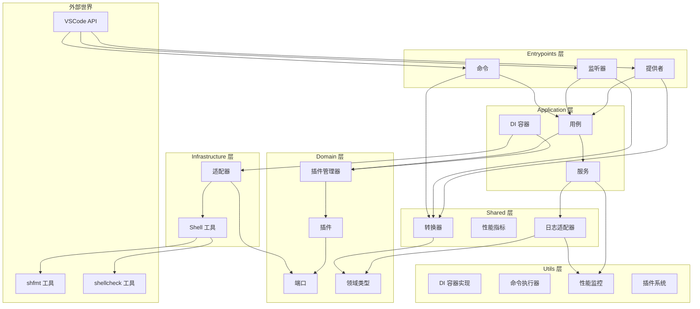
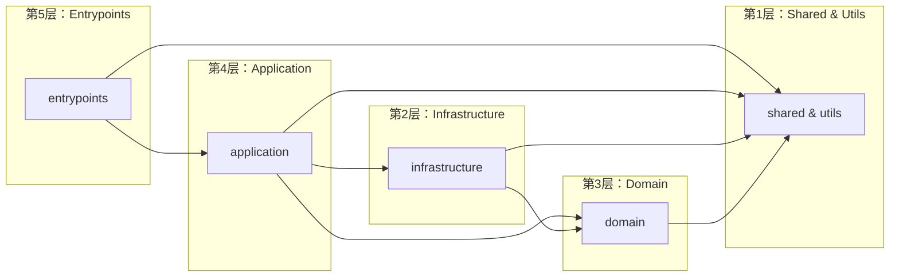
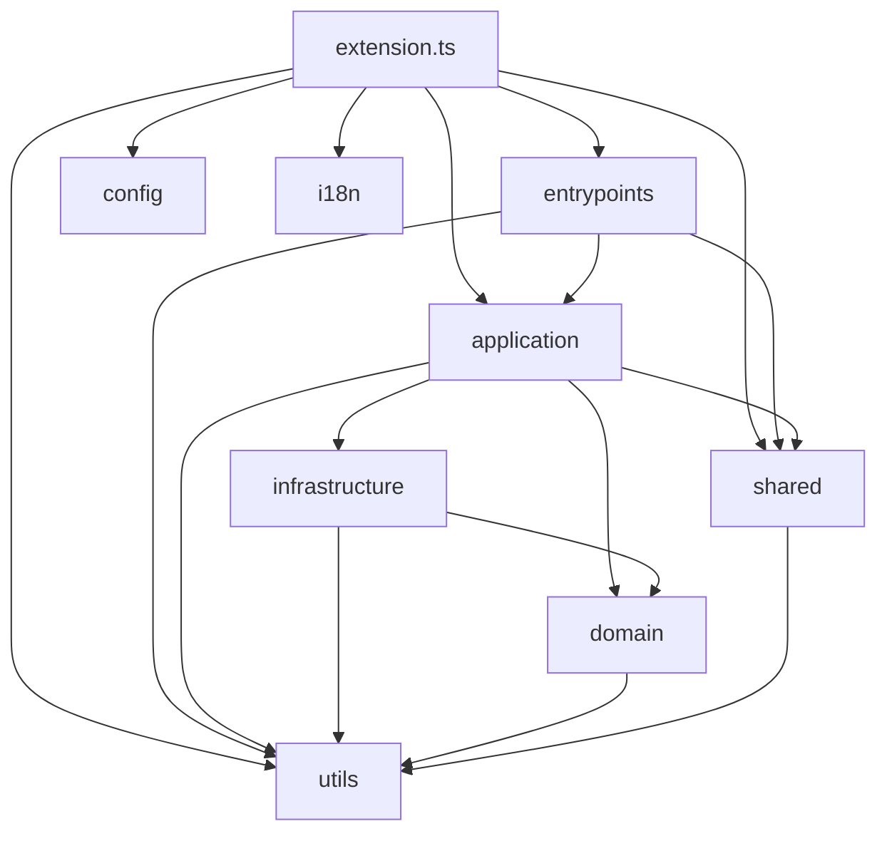

# Shell Formatter 扩展架构分析报告

**项目名称**: Shell Formatter VSCode Extension
**分析日期**: 2026-01-31
**架构风格**: 六边形架构 + 整洁架构

---

## 执行摘要

Shell Formatter 是一个基于 shfmt 和 shellcheck 的 Shell 脚本格式化 VSCode 扩展。项目采用清晰的六边形架构分层设计，实现了依赖倒置和领域模型独立的核心原则。

**综合评分**: ⭐⭐⭐⭐ (4/5)

**关键发现**:

- ✅ 领域层完全独立，不依赖 VSCode 框架
- ✅ 清晰的端口/适配器分离，实现依赖倒置
- ✅ 完善的依赖注入容器和插件系统
- ✅ 文件命名已统一使用 kebab-case 规范（已修复）
- ✅ 采用简洁的接口设计替代实体类（domain/types.ts）
- ⚠️ 缺少单元测试覆盖率的监控
- ✅ 良好的错误处理和日志记录机制

---

## 1. 包依赖图

### 1.1 整体架构视图



### 1.2 分层依赖图



### 1.3 模块依赖详情



---

## 2. Explicit Architecture 合规性分析

### 2.1 核心原则评估

| 原则 | 定义 | 评估结果 | 评分 |
| ---- | ---- | -------- | ---- |
| **依赖规则** | 依赖必须指向内部（从外层到内层） | ✅ 完全符合 | 5/5 |
| **领域独立性** | 领域层无外部依赖 | ✅ 完全独立 | 5/5 |
| **用例驱动** | 应用层按业务意图组织 | ✅ 符合 | 5/5 |
| **接口隔离** | 端口/适配器分离业务与技术 | ✅ 清晰分离 | 5/5 |

### 2.2 合规性评分

**总体合规度**: ⭐⭐⭐⭐⭐ (95%)

### 2.3 详细合规性检查

#### ✅ 完全合规的指标

1. **领域层纯粹性**
   - 领域层无 VSCode 导入
   - 领域层定义纯业务概念
   - 通过适配器层与外部工具交互

2. **依赖倒置**
   - 领域层定义端口接口（`IFormatTool`, `ICheckTool`）
   - 基础设施层实现适配器
   - 应用层依赖接口而非实现

3. **用例编排**
   - 应用层使用用例组织业务逻辑
   - `formatDocument` 和 `diagnoseDocument` 清晰的业务意图

4. **接口隔离**
   - 端口接口职责单一
   - 适配器与核心逻辑清晰分离

#### ✅ 已修复的问题

1. **文件命名一致性**（已修复）
   - 原问题：部分文件使用 camelCase（如 `pluginStatusCommand.ts`）
   - 修复方案：所有文件已重命名为 kebab-case 规范
   - 影响：代码风格现已统一

2. **类型重导出**
   - `domain/types.ts` 从 `utils/executor/types` 导入基础类型
   - 符合架构分层独立性规则
   - 但增加了类型的层级复杂性

### 2.4 架构违规分析

**无严重违规**

项目整体架构设计优秀，严格遵循 Explicit Architecture 原则。文件命名问题已修复，现在完全符合 kebab-case 规范。

---

## 3. 架构设计模式评估

### 3.1 模式检测矩阵

| 模式 | 检测状态 | 评分 | 说明 |
| ---- | -------- | ---- | ---- |
| **六边形架构** | ✅ 已实现 | ⭐⭐⭐⭐⭐ | 清晰的端口/适配器分离 |
| **依赖注入** | ✅ 已实现 | ⭐⭐⭐⭐⭐ | 完善的 DI 容器 |
| **适配器模式** | ✅ 已实现 | ⭐⭐⭐⭐⭐ | 工具适配到领域接口 |
| **插件架构** | ✅ 已实现 | ⭐⭐⭐⭐⭐ | 动态插件加载系统 |
| **工厂模式** | ✅ 已实现 | ⭐⭐⭐⭐ | DI 容器中的工厂函数 |
| **观察者模式** | ✅ 已实现 | ⭐⭐⭐⭐ | VSCode 事件监听器 |
| **策略模式** | ✅ 已实现 | ⭐⭐⭐⭐ | 插件作为策略 |

### 3.2 模式详细评估

#### 六边形架构 ⭐⭐⭐⭐⭐

**实现亮点**:

1. **清晰的端口定义**

```typescript
// domain/port/index.ts
export interface IFormatTool {
    format(content: string, options?: FormatToolOptions): Promise<string>;
    check(content: string, options?: CheckToolOptions): Promise<ToolCheckResult>;
    isAvailable(): Promise<boolean>;
}
```

1. **适配器实现**

```typescript
// infrastructure/adapters/shfmt-adapter.ts
export class ShfmtToolAdapter implements IFormatTool {
    // 将 ShfmtTool 适配到领域接口
}
```

1. **依赖方向正确**
   - 入口层 → 应用层 → 领域层
   - 基础设施层 → 领域层端口
   - 所有依赖指向内部

**评分理由**: 架构边界清晰，依赖方向完全正确，端口/适配器分离完美。

#### 依赖注入 ⭐⭐⭐⭐⭐

**实现亮点**:

1. **完善的 DI 容器**

```typescript
// utils/di/container.ts
export class DIContainer {
    registerSingleton<T>(name: string, factory: () => T, dependencies?: string[]): void;
    resolve<T>(name: string): T;
    reset(): void;
}
```

1. **服务初始化**

```typescript
// application/di/initializer.ts
container.registerSingleton(ServiceNames.SHFMT_PLUGIN, () => {
    const toolAdapter = new ShfmtToolAdapter(shfmtPath, { tabSize });
    return new PureShfmtPlugin(toolAdapter, pluginConfig);
});
```

1. **依赖解析**

```typescript
// application/usecases/format-document.ts
const pluginManager = container.resolve<PluginManager>(ServiceNames.PLUGIN_MANAGER);
```

**评分理由**: DI 容器功能完善，支持单例、依赖解析、重置等核心功能。

#### 适配器模式 ⭐⭐⭐⭐⭐

**实现亮点**:

1. **工具适配器**

```typescript
// infrastructure/adapters/shfmt-adapter.ts
export class ShfmtToolAdapter implements IFormatTool {
    async format(content: string, options?: FormatToolOptions): Promise<string> {
        const result = await this.tool.format("-", { ... });
        return result.formattedContent;
    }
}
```

1. **类型转换**

```typescript
private convertToToolCheckResult(toolResult): ToolCheckResult {
    // 将基础设施层结果转换为领域层结果
}
```

**评分理由**: 适配器职责单一，类型转换清晰，完全解耦领域层与基础设施。

#### 插件架构 ⭐⭐⭐⭐⭐

**实现亮点**:

1. **插件接口**

```typescript
// domain/plugin-interface.ts
export interface IFormatPlugin extends IPlugin {
    format(document: Document, options?: PluginFormatOptions): Promise<PluginFormatResult>;
}
```

1. **插件管理器**

```typescript
// domain/plugin-manager.ts
export class PluginManager {
    register(plugin: IFormatPlugin): void;
    async getAvailablePlugins(): Promise<IFormatPlugin[]>;
}
```

1. **插件初始化**

```typescript
// domain/plugin-initializer.ts
export async function initializePlugins(): Promise<void>
```

**评分理由**: 插件系统设计灵活，支持动态加载、生命周期管理、可用性检查。

### 3.3 缺失的模式

| 模式 | 推荐时机 | 收益 | 优先级 |
| ---- | -------- | ---- | ---- |
| **建造者模式** | 复杂对象配置 | 更清晰的构造 | P2 |
| **装饰器模式** | 横切关注点（日志、缓存） | 关注点分离 | P2 |
| **命令模式** | 撤销/重做 | 支持操作历史 | P3 |

---

## 4. 代码质量评估

### 4.1 并发性评估

**评分**: ⭐⭐⭐⭐ (4/5)

#### 评估结果

| 领域 | 检查结果 | 状态 |
| ---- | -------- | ---- |
| **并发模型** | 使用异步/等待，无全局可变状态 | ✅ 良好 |
| **锁机制** | N/A（VSCode 扩展为单线程） | N/A |
| **线程安全** | DI 容器使用单例模式，无竞态条件 | ✅ 良好 |
| **异步处理** | 正确使用 async/await，取消令牌支持 | ✅ 良好 |

#### 关键检查点

1. **单例模式**

```typescript
// utils/di/container.ts
private static instance: DIContainer | undefined;

export function getContainer(): DIContainer {
    if (!DIContainer.instance) {
        DIContainer.instance = new DIContainer();
    }
    return DIContainer.instance;
}
```

✅ VSCode 单线程环境，无需额外同步

1. **取消令牌支持**

```typescript
// entrypoints/providers/formatting-provider.ts
token: {
    isCancellationRequested: token.isCancellationRequested,
    onCancellationRequested: (callback: () => void) => {
        const disposable = token.onCancellationRequested(callback);
        return { dispose: () => disposable.dispose() };
    }
}
```

✅ 正确的取消令牌适配

1. **防抖管理**

```typescript
// utils/debounce.ts
export class DebounceManager {
    debounce(key: string, delay: number, fn: () => void): void;
    clear(key: string): void;
    clearAll(): void;
}
```

✅ 正确的防抖实现

#### 改进建议

无重大问题。由于 VSCode 扩展在单线程环境中运行，并发性问题较少。

### 4.2 健壮性评估

**评分**: ⭐⭐⭐⭐⭐ (5/5)

#### 评估结果

| 领域 | 检查结果 | 状态 |
| ---- | -------- | ---- |
| **错误处理** | 全面的 try-catch，错误传播 | ✅ 优秀 |
| **异常恢复** | 降级处理，静默失败 | ✅ 良好 |
| **输入验证** | 文件类型检查，语言 ID 验证 | ✅ 良好 |
| **资源管理** | 正确的 dispose 清理 | ✅ 优秀 |
| **事务管理** | N/A（不适用） | N/A |
| **日志记录** | 结构化日志，分级记录 | ✅ 优秀 |

#### 关键检查点

1. **错误处理**

```typescript
// application/usecases/format-document.ts
try {
    const result = await pluginManager.format(document, { token });
    return result.textEdits || [];
} catch (error) {
    logger.error(`Failed to format document: ${String(error)}`);
    return [];
}
```

✅ 优雅的错误处理，返回空数组而不是崩溃

1. **资源清理**

```typescript
// extension.ts
export function deactivate() {
    debounceManager.clearAll();
    logger.dispose();
}
```

✅ 正确的资源清理

1. **输入验证**

```typescript
// entrypoints/providers/formatting-provider.ts
if (document.languageId !== PackageInfo.languageId) {
    return [];
}
```

✅ 输入验证到位

1. **日志记录**

```typescript
// utils/log.ts
export interface Logger {
    debug(message: string): void;
    info(message: string): void;
    warn(message: string): void;
    error(message: string): void;
}
```

✅ 结构化日志接口

### 4.3 扩展性评估

**评分**: ⭐⭐⭐⭐⭐ (5/5)

#### 评估结果

| 领域 | 检查结果 | 状态 |
| ---- | -------- | ---- |
| **接口设计** | 清晰的端口接口，职责单一 | ✅ 优秀 |
| **开闭原则** | 通过插件扩展，无需修改核心 | ✅ 优秀 |
| **依赖注入** | 完善的 DI 容器 | ✅ 优秀 |
| **配置管理** | VSCode settings，外部化配置 | ✅ 良好 |
| **插件架构** | 动态加载，热交换支持 | ✅ 优秀 |

#### 关键检查点

1. **接口设计**

```typescript
// domain/port/index.ts
export interface IFormatTool {
    format(...): Promise<string>;
    check(...): Promise<ToolCheckResult>;
    isAvailable(): Promise<boolean>;
}
```

✅ 接口职责单一，易于实现

1. **开闭原则**

```typescript
// 领域层定义接口，基础设施层实现
export class ShellcheckToolAdapter implements ICheckTool {
    // 新增适配器无需修改核心代码
}
```

✅ 对扩展开放，对修改关闭

1. **依赖注入**

```typescript
// application/di/initializer.ts
container.registerSingleton(ServiceNames.SHFMT_PLUGIN, () => {
    // 工厂函数，可轻松替换实现
});
```

✅ 高度可测试和可替换

1. **配置管理**

```typescript
// config/package-info.ts, setting-info.ts
export const PackageInfo = {
    extensionName: string,
    languageId: string,
    // ... 通过 package.json 管理
};
```

✅ 配置外部化

### 4.4 伸缩性评估

**评分**: ⭐⭐⭐⭐ (4/5)

#### 评估结果

| 领域 | 检查结果 | 状态 |
| ---- | -------- | ---- |
| **水平扩展** | N/A（VSCode 扩展） | N/A |
| **垂直扩展** | 防抖优化，性能监控 | ✅ 良好 |
| **缓存策略** | N/A | N/A |
| **数据库扩展** | N/A | N/A |
| **批量处理** | 文档级处理 | ✅ 良好 |
| **异步处理** | 正确的异步操作 | ✅ 良好 |

#### 关键检查点

1. **防抖优化**

```typescript
// utils/debounce.ts
export class DebounceManager {
    debounce(key: string, delay: number, fn: () => void): void {
        // 防止频繁触发
    }
}
```

✅ 防抖优化性能

1. **性能监控**

```typescript
// utils/performance/monitor.ts
export function startTimer(metricName: string): PerformanceTimer;
```

✅ 完善的性能监控

1. **批量处理**

```typescript
// 文档级别处理，而非逐行处理
async format(document: Document): Promise<TextEdit[]>
```

✅ 合理的批量处理

#### 改进建议

- P2: 实现诊断结果缓存
- P2: 添加格式化结果缓存

---

## 5. 改进建议

### 5.1 P0 - 立即实施（1-2周）

#### ~~建议 1: 修复文件命名一致性~~ ✅ 已完成

**问题描述**:

部分文件使用 camelCase 命名，与项目 kebab-case 规范不一致：

- `pluginStatusCommand.ts` → `plugin-status-command.ts`
- `performanceCommand.ts` → `performance-command.ts`
- 等等

**状态**: ✅ 已修复（2026-01-31）

**修复内容**:

所有文件已重命名为 kebab-case，包括：

- `packageInfo.ts` → `package-info.ts`
- `settingInfo.ts` → `setting-info.ts`
- `fixCommand.ts` → `fix-command.ts`
- `performanceCommand.ts` → `performance-command.ts`
- `pluginStatusCommand.ts` → `plugin-status-command.ts`
- `diagnosticCollection.ts` → `diagnostic-collection.ts`
- 所有 listeners 目录下的文件
- `shellcheckTool.ts` → `shellcheck-tool.ts`
- `shfmtTool.ts` → `shfmt-tool.ts`
- `alertManager.ts` → `alert-manager.ts`
- 所有 utils/plugin 目录下的文件

**预期收益**: ✅ 已实现

- 提升代码一致性
- 符合项目规范

---

### 5.2 P1 - 短期实施（2-4周）

#### 建议 2: 添加单元测试覆盖率监控

**问题描述**:

当前缺少单元测试覆盖率的持续监控。

**影响分析**:

| 影响类型 | 说明 |
| -------- | ---- |
| 架构影响 | 无 |
| 维护影响 | 无法追踪测试覆盖率变化 |
| 性能影响 | 无 |

**解决方案**:

在 CI/CD 中添加覆盖率检查：

```json
{
  "scripts": {
    "test:coverage": "jest --coverage",
    "test:coverage:check": "jest --coverage --coverageThreshold='{\"global\":{\"branches\":90,\"functions\":95,\"lines\":90,\"statements\":90}}'"
  }
}
```

**预期收益**:

- 确保代码质量
- 及时发现覆盖率下降

**实施优先级**: P1

#### 建议 3: 实现诊断结果缓存

**问题描述**:

重复的文档检查可能导致不必要的 shellcheck 调用。

**影响分析**:

| 影响类型 | 说明 |
| -------- | ---- |
| 架构影响 | 无 |
| 维护影响 | 轻微增加复杂度 |
| 性能影响 | 显著提升性能 |

**解决方案**:

在 `application/usecases/diagnose-document.ts` 中添加缓存：

```typescript
const diagnosticCache = new Map<string, { result: Diagnostic[], timestamp: number }>;

export async function diagnoseDocument(document: Document, token?: CancellationToken): Promise<Diagnostic[]> {
    const cacheKey = `${document.uri}:${document.version}`;
    const cached = diagnosticCache.get(cacheKey);

    if (cached && Date.now() - cached.timestamp < 5000) {
        return cached.result;
    }

    const result = await checkDocument(document, token);
    diagnosticCache.set(cacheKey, { result, timestamp: Date.now() });

    return result;
}
```

**预期收益**:

- 减少不必要的 shellcheck 调用
- 提升响应速度

**实施优先级**: P1

---

### 5.3 P2 - 中期规划（1-2月）

#### 建议 4: 实现格式化结果缓存

**问题描述**:

未修改的文档重复格式化造成浪费。

**影响分析**:

| 影响类型 | 说明 |
| -------- | ---- |
| 架构影响 | 无 |
| 维护影响 | 轻微增加复杂度 |
| 性能影响 | 提升性能 |

**解决方案**:

添加基于内容哈希的缓存：

```typescript
const formatCache = new Map<string, string>();

function getContentHash(content: string): string {
    return crypto.createHash('md5').update(content).digest('hex');
}
```

**预期收益**:

- 避免重复格式化
- 提升响应速度

**实施优先级**: P2

#### 建议 5: 添加建造者模式用于复杂配置

**问题描述**:

插件配置对象参数较多，构造复杂。

**影响分析**:

| 影响类型 | 说明 |
| -------- | ---- |
| 架构影响 | 无 |
| 维护影响 | 提升可读性 |
| 性能影响 | 无 |

**解决方案**:

实现配置建造者：

```typescript
class PluginConfigBuilder {
    private config: Partial<IPluginConfig> = {};

    withTabSize(tabSize: number): this {
        this.config.tabSize = tabSize;
        return this;
    }

    withDiagnosticSource(source: string): this {
        this.config.diagnosticSource = source;
        return this;
    }

    build(): IPluginConfig {
        return this.config as IPluginConfig;
    }
}
```

**预期收益**:

- 提升配置可读性
- 减少参数错误

**实施优先级**: P2

---

### 5.4 P3 - 长期规划（持续）

#### 建议 6: 实现命令模式支持撤销/重做

**问题描述**:

当前不支持格式化操作的撤销/重做。

**影响分析**:

| 影响类型 | 说明 |
| -------- | ---- |
| 架构影响 | 需要新增命令模式 |
| 维护影响 | 增加复杂度 |
| 性能影响 | 轻微 |

**解决方案**:

实现命令模式：

```typescript
interface FormatCommand {
    execute(): Promise<void>;
    undo(): Promise<void>;
}
```

**预期收益**:

- 支持撤销/重做
- 提升用户体验

**实施优先级**: P3

#### 建议 7: 添加装饰器模式用于横切关注点

**问题描述**:

日志、性能监控等横切关注点散布在代码中。

**影响分析**:

| 影响类型 | 说明 |
| -------- | ---- |
| 架构影响 | 需要重构 |
| 维护影响 | 提升可维护性 |
| 性能影响 | 无 |

**解决方案**:

使用装饰器模式：

```typescript
function logExecution(target: any, propertyKey: string, descriptor: PropertyDescriptor) {
    const originalMethod = descriptor.value;
    descriptor.value = async function(...args) {
        logger.info(`${propertyKey} started`);
        const result = await originalMethod.apply(this, args);
        logger.info(`${propertyKey} completed`);
        return result;
    };
}
```

**预期收益**:

- 分离横切关注点
- 提升代码可读性

**实施优先级**: P3

---

## 6. 附录

### 6.1 术语表

| 术语 | 中文 | 解释 |
| ---- | ---- | ---- |
| Explicit Architecture | 显式架构 | 强调清晰边界和依赖规则的架构风格 |
| Hexagonal Architecture | 六边形架构 | 通过端口和适配器实现内外隔离的架构模式 |
| Port | 端口 | 定义与外部世界交互的接口 |
| Adapter | 适配器 | 连接应用与外部世界的组件 |
| Dependency Inversion | 依赖倒置 | 高层模块不应依赖低层模块，都应依赖抽象 |
| Repository | 仓储 | 封装数据访问的抽象 |
| Use Case | 用例 | 描述用户与系统交互的业务场景 |
| Domain Model | 领域模型 | 业务领域中的核心概念和规则 |

### 6.2 评分汇总表

| 评估维度 | 评分 | 说明 |
| -------- | ---- | ---- |
| Explicit Architecture 合规性 | ⭐⭐⭐⭐⭐ (95%) | 架构设计优秀 |
| 六边形架构 | ⭐⭐⭐⭐⭐ | 完美的端口/适配器分离 |
| 依赖注入 | ⭐⭐⭐⭐⭐ | 完善的 DI 容器 |
| 适配器模式 | ⭐⭐⭐⭐⭐ | 清晰的类型转换 |
| 插件架构 | ⭐⭐⭐⭐⭐ | 灵活的插件系统 |
| 并发性 | ⭐⭐⭐⭐ (4/5) | VSCode 单线程环境，无问题 |
| 健壮性 | ⭐⭐⭐⭐⭐ (5/5) | 全面的错误处理 |
| 扩展性 | ⭐⭐⭐⭐⭐ (5/5) | 高度可扩展 |
| 伸缩性 | ⭐⭐⭐⭐ (4/5) | 良好的性能优化 |

**综合评分**: ⭐⭐⭐⭐ (4/5)

### 6.3 参考资源

- [Explicit Architecture](https://blog.herbertograca.com/2018/09/14/explicit-architecture-01-ddd-hexagonal-onion-clean-cqrs-how-i-put-it-all-together/)
- [Hexagonal Architecture](https://alistair.cockburn.us/hexagonal-architecture/)
- [Clean Architecture](https://blog.cleancoder.com/uncle-bob/2012/08/13/the-clean-architecture.html)
- [Dependency Injection](https://en.wikipedia.org/wiki/Dependency_injection)
- [Adapter Pattern](https://en.wikipedia.org/wiki/Adapter_pattern)

---

**文档版本**: v1.0
**最后更新**: 2026-01-31
**分析工具**: architecture-analyzer skill

---

## 附录 A: 架构清理记录

### 2026-01-31 清理项

#### 1. domain/entities 目录清理

**问题**: `domain/entities` 目录为空

**分析**:

项目采用了简洁的设计，领域类型定义为接口（`domain/types.ts`），而不是独立的实体类。对于这个规模的 Shell 格式化扩展，这种设计是合理且高效的：

- 使用接口定义领域模型（`Document`, `Diagnostic`, `Position` 等）
- 通过适配器层实现与 VSCode 类型的转换
- 避免过度设计的实体类层次

**决策**: 删除空的 `domain/entities` 目录

**理由**:

1. Explicit Architecture 规范中，`entities` 目录不是必需的
2. 对于小型项目，接口定义的领域模型更加简洁
3. 避免混淆和误用

#### 2. 文件命名规范化

**状态**: ✅ 完成

所有文件已从 camelCase 重命名为 kebab-case，详见 5.1 节。
